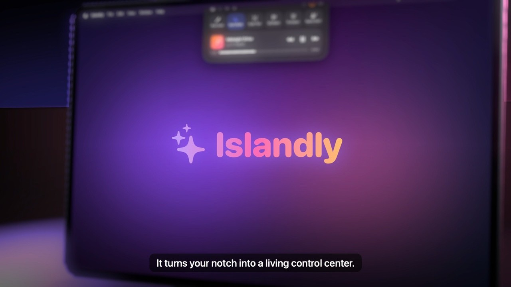
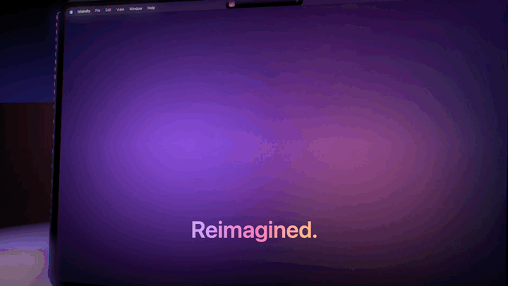

<div align="center">



# ✨ Islandly

**Your MacBook's notch, alive.**
A living control center that grows out of the notch — music, meeting alerts, a teleprompter under your camera,
live build status, screen tools and more. Native Swift & SwiftUI, 100% on-device, under 1% CPU.



⚡ [Quick start](#quick-start) · 🤝 [Contributions welcome](CONTRIBUTING.md)

</div>

---

## Features

| | |
|---|---|
| 🎵 **Now Playing** | Apple Music, Spotify and YouTube / YouTube Music in Chrome. Play, pause, scrub, and **two-finger swipe** the card to skip. Switch between open YouTube tabs; starting one pauses the others. |
| 👂 **Name Alert** | Listens to what your Mac *plays* during calls (Teams, Zoom, Meet, Slack…) and **flashes purple** when someone says your name or a keyword — even while you're muted. Optional "buzz when away": screen flash + chime + spoken callout. |
| 🎬 **Teleprompter** | Your script scrolls **right under the camera**, at a fixed speed or following your voice, so you keep eye contact. |
| 🔨 **Build activities** | Prefix any command with `notch` — watch it run live in the notch and get a ✅ / ❌ with the error line when it ends. |
| 🖥️ **Dev servers** | Everything you're serving on local ports: Django, Next.js, Vite, Postgres, SSH tunnels… Open one in the browser, or stop a stuck one. Only scanned while the tab is open. |
| 🔤 **Grab Text** | Drag a box over anything on screen (video, image, PDF, screen share) and its text is copied. Reads QR codes too. |
| 📱 **Phone** | One tile, three modes. **Send**: whatever you copied, or a running dev server's network URL, as a QR code. **Receive**: scan a code and send photos, files or text from any phone (iPhone or Android) to the Shelf. **Sign**: sign with your finger on the phone; a transparent signature lands on the Mac's clipboard, ready to paste into any PDF or doc. |
| 🎨 **Pick Color** · 🌙 **Dark Mode** | Sample any pixel as a hex code; toggle system appearance. |
| ⏱️ **Timers** | Quick focus timers with a countdown ring beside the notch. |
| 🗂️ **Shelf** · 📋 **Clipboard** | Drop files on the notch to park them; your last 25 copied texts, one click to copy again. |
| 📅 **Meetings** | Next event with a countdown and a one-click **Join** for Zoom / Meet / Teams links. |
| ☕ **Keep Awake** | Stop your Mac from sleeping for 30 min, 1 h, 2 h or until turned off. |
| 🔋 **Live activities** | Charging, song changes, timer done, meeting starting — little pop-ups under the notch. |

## Quick start

Already have macOS 26 and Apple's command-line tools? Three commands:

```bash
git clone https://github.com/Zayan-dev/islandly.git
cd islandly
./scripts/install.sh
```

Then **hover over your notch**. First time, or something didn't work? Follow [Installation](#installation) below.

## Installation

### 1. Check your Mac

| | |
|---|---|
| **macOS 26 (Tahoe)** or later | Uses Liquid Glass and newer ScreenCaptureKit / Core Audio APIs. |
| **Apple Silicon or Intel** | `install.sh` builds for your Mac; `build.sh` builds a universal app. |
| A **MacBook with a notch** is ideal | On other Macs it appears as a pill at the top of the screen. |
| **Google Chrome** *(optional)* | Only for YouTube control. Apple Music and Spotify work directly. |

### 2. Install Apple's command-line tools

Islandly is built on your Mac from source (no Xcode needed). If you've never installed the tools:

```bash
xcode-select --install
```

A macOS dialog opens; click **Install** and wait for it to finish. Already installed? The command says so; move on.

### 3. Download and install Islandly

```bash
git clone https://github.com/Zayan-dev/islandly.git
cd islandly
./scripts/install.sh
```

`install.sh` builds the app for your Mac, copies it to **Applications**, adds the `notch` command to your `PATH`,
and launches Islandly. It takes about a minute. If it prints a line to add to `~/.zshrc`, run it and open a new terminal.

### 4. First launch

- **Hover over the notch** to open the island; move away to close it.
- Each feature asks for its permission the **first time you use it**, never up front. Skip the ones you don't need
  (see [Permissions](#permissions)). A tile with an **orange dot** needs a permission; a **greyed-out tile with a lock**
  isn't available on your Mac. Hover either one to see why.
- After allowing **Screen Recording** (for Grab Text or Name Alert), restart Islandly once:
  right-click the notch → **Restart Islandly**.
- The first time you use **Phone ▸ Receive** or **Sign**, macOS may ask to allow **local network** / **incoming
  connections** for Islandly. Allow it, or your phone can't reach the Mac.

### 5. Optional setup

- **YouTube in Chrome:** in Chrome's menu bar enable **View → Developer → Allow JavaScript from Apple Events**.
- **Start at login:** **System Settings → General → Login Items → +** → choose **Islandly**.
- **Keep permissions across updates:** macOS ties permissions to the app's signature, and without a certificate each
  rebuild looks like a new app (you'd re-allow Screen Recording etc. after every update). A free self-signed
  certificate fixes it, one time:
  1. Open **Keychain Access** → menu **Keychain Access → Certificate Assistant → Create a Certificate…**
  2. Name **`Islandly Dev`** · Identity Type **Self-Signed Root** · Certificate Type **Code Signing** → **Create**.
  3. Run `./scripts/install.sh` again. From now on builds are signed with it automatically.

### Update, uninstall, build only

```bash
git pull && ./scripts/install.sh       # update to the latest version
./scripts/uninstall.sh                 # remove the app and the notch command
./scripts/uninstall.sh --all           # …and also reset its settings and permissions
./build.sh && open build/Islandly.app  # build and run without installing (universal: Apple Silicon + Intel)
```

## Permissions

Each is requested the first time you use the feature — skip the ones you don't need.

| Permission | Used by | Where to change it |
|---|---|---|
| **Automation** → Chrome, Music, Spotify, System Events | Now Playing, Dark Mode | Privacy & Security → Automation |
| Chrome **View → Developer → Allow JavaScript from Apple Events** | YouTube controls | Chrome menu bar |
| **Screen & System Audio Recording** | Grab Text, Name Alert | Privacy & Security → Screen & System Audio Recording |
| **Speech Recognition** | Name Alert, voice-following teleprompter | Privacy & Security → Speech Recognition |
| **Microphone** | Teleprompter voice-follow only | Privacy & Security → Microphone |
| **Calendars** | Next meeting + Join button | Privacy & Security → Calendars |
| **Local Network** / incoming connections | Phone ▸ Receive and Sign | Privacy & Security → Local Network · Network → Firewall |

## The `notch` command

Prefix any long-running command and watch it in the notch (installed by `install.sh`):

```bash
notch npm run build
notch python3 manage.py test
notch git push
```
Output, colors and exit codes pass through unchanged — you get a ✅ or ❌ with the error line when it finishes.

## Privacy & performance

- **Everything runs on your Mac.** Speech is transcribed with Apple's on-device recognizer; text and QR codes are read
  with Apple's Vision framework. Nothing is recorded, stored or sent anywhere.
- The only network requests are album/video artwork from the services you're already playing.
- Islandly opens **no network ports** except while **Phone ▸ Receive** is showing: then a small upload page is served on your
  Wi-Fi at a random one-time link (every other path returns 404; files up to 2 GB; stops after 10 idle minutes).
- Clipboard history lives in memory only and skips password-manager items.
- Idle CPU is **under 1%**: hover is event-driven, and polling slows down while the island is closed.
- Name Alert's optional "browser calls" detection is **off by default** (it checks browser tabs every 30 s).

## Troubleshooting

| Problem | Fix |
|---|---|
| A tile has an orange dot | It needs a permission. Hover it to see which one, then click it to open that page in System Settings |
| A tile is greyed out with a lock | This Mac can't run that feature (e.g. Name Alert without on-device speech recognition). Hover it to see why |
| YouTube shows an orange "Enable Chrome…" note | Chrome → **View → Developer → Allow JavaScript from Apple Events** |
| Grab Text says "Nothing readable found" | Grant **Screen & System Audio Recording**, then **Restart Islandly** |
| Permissions keep resetting after each build | Create the `Islandly Dev` certificate (see above) |
| Name Alert misses your name | Names at the very start of a sentence are sometimes dropped by the recognizer; add nicknames as keywords |
| Island stuck or misbehaving | Right-click the notch → **Restart Islandly**, or `pkill -x Islandly; open -a Islandly` |
| `notch: command not found` | Run the PATH line printed at the end of `install.sh`, or open a new terminal |

## Project layout

```
Sources/        Swift sources (SwiftUI views, models, ScreenCaptureKit / Vision / Speech integrations)
bin/notch       CLI wrapper for build live activities
build.sh        Builds a universal, signed Islandly.app
scripts/        install.sh / uninstall.sh, release.sh (optional zip), make-icon.swift (draws the app icon)
Resources/      App icon (AppIcon.icns)
docs/           README media
```

## Contributing

Found a bug or have an idea? Contributions are very welcome:

- 🐛 **Report a bug** or 💡 **suggest a feature** in [Issues](../../issues)
- 🔧 **Send a fix** — fork the repo, make your change on a branch, and open a pull request

See [CONTRIBUTING.md](CONTRIBUTING.md) for how to build, the guidelines, and what to include.

## License

Islandly is **source-available**: you're welcome to read the code, fork it, and contribute via pull requests.
Other use or redistribution requires permission — see [LICENSE](LICENSE). © 2026 Muhammad Zayan. All rights reserved.

<sub>Islandly is an independent project and is not affiliated with Apple Inc. Dynamic Island, MacBook and macOS are
trademarks of Apple Inc.</sub>
