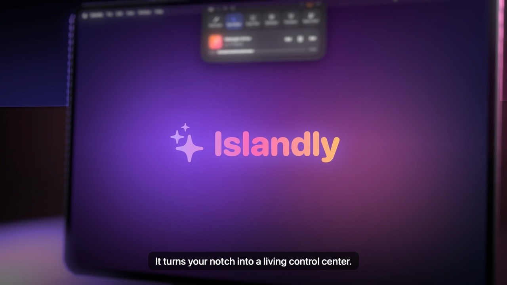
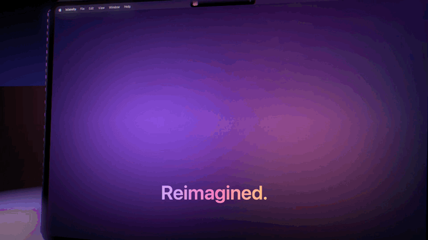

<div align="center">



# ✨ Islandly

**Your MacBook's notch, alive.**
A living control center that grows out of the notch: music, a name alert for calls, a teleprompter under your camera,
Claude Code & Codex approvals, GitHub CI, a world clock, screen and phone tools and more.
Native Swift & SwiftUI, private by design, light on battery.



⚡ [Quick start](#quick-start) · 🤝 [Contributions welcome](CONTRIBUTING.md)

</div>

---

## Features

Hover over the notch to open the island; move away to close it. Tabs along the top: **Home**, **Dev**, **Timer**,
**World**, **Shelf** and **Clipboard**. Right-click the notch for [settings](#the-right-click-menu).

### 🎧 Everyday

| | |
|---|---|
| 🎵 **Now Playing** | Apple Music, Spotify and YouTube / YouTube Music in Chrome. Play, pause, scrub, and **two-finger swipe** the card to skip. Switch between open YouTube tabs; starting one pauses the others. Album art and a little wave peek out beside the closed notch. |
| 🌍 **World Clock** | Your time, big, plus the cities you work with: ☀️/🌙, a 🟢 dot during their work hours, how far ahead or behind, and "tomorrow"/"yesterday". **Drag the slider** to see every clock at another time ("9 PM here is noon in New York"). Add cities by country or time zone. **Copy a time like "3pm EST" anywhere** and the notch shows it in your time. [More →](#world-clock) |
| ⏱️ **Timers** | One-click 1–60 minute timers with a countdown ring beside the notch and a chime when done. |
| 🗂️ **Shelf** · 📋 **Clipboard** | Drop files on the notch to park them, drag them out anywhere later. Your last 25 copied texts, one click to copy again. |
| 📅 **Meetings** | Your next event with a countdown and a one-click **Join** for Zoom / Meet / Teams links. |
| ☕ **Keep Awake** · 🌙 **Dark Mode** | Stop your Mac from sleeping (30 min, 1 h, 2 h or until turned off). Toggle light / dark appearance. |
| 🔋 **Live activities** | Little pop-ups under the notch: charging, song changes, timer done, meeting starting, files from your phone, builds and CI finishing. |

### 🗣️ Calls & presenting

| | |
|---|---|
| 👂 **Name Alert** | Listens to what your Mac *plays* during calls (Teams, Zoom, Meet, Slack…) and **flashes purple** when someone says your name or a keyword, even while you're muted. Optional "buzz when away": screen flash, chime and spoken callout. On during calls only, always, or off. |
| 🎬 **Teleprompter** | Your script scrolls **right under the camera**, at a fixed speed or following your voice, so you keep eye contact. Hover for speed and line controls; **Esc** closes it. |
| 🙈 **Hidden when sharing your screen** | People on a call never see Islandly: not the notch opening, not the teleprompter, not the Ask bubble. On by default; right-click the notch to turn it off (e.g. to record a demo). |

### 👨‍💻 For developers

| | |
|---|---|
| 🤖 **Coding agents** | **Claude Code** and **Codex** (terminal, VS Code / JetBrains / Antigravity extensions, the Claude desktop Code tab, the Codex app) show what they're doing beside the notch and say when they're done, and their **permission requests appear in the notch: Allow / Deny right there**. [Setup →](#coding-agents-claude-code--codex) |
| ⌥ **Hold to ask** | Like asking a friend who can see your screen: point at anything, **hold Option and ask out loud** ("why is this failing?"), let go. **Claude or Codex answers in a bubble at your cursor and reads it to you**; hold ⌥ by the bubble to reply by voice. Drag the bubble anywhere, resize it from the corner, **Esc** closes it. Uses your own Claude Code / Codex login; off until you turn it on. |
| ✅ **GitHub CI** | Push, and a **progress ring** fills beside the notch while GitHub Actions runs; then **✅ passed** or **❌ failed** with the job and step that broke. Your own pushes are noticed instantly. No GitHub CLI yet? One click sets it up. [More →](#github-ci) |
| 🔨 **Build activities** | Prefix any command with `notch` and watch it run live in the notch; get a ✅ / ❌ with the error line when it ends. [More →](#the-notch-command) |
| 🖥️ **Dev servers** | Everything you're serving on local ports: Django, Next.js, Vite, Postgres, SSH tunnels… Open one in the browser, **on your phone with a QR code**, or stop a stuck one. Only scanned while the tab is open. |

### 📱 Screen & phone tools

| | |
|---|---|
| 🔤 **Grab Text** | Drag a box over anything on screen (video, image, PDF, screen share) and its text is copied. Reads QR codes too. |
| 📱 **Phone** | One tile, three modes. **Send**: whatever you copied, or a dev server's network URL, as a QR code. **Receive**: scan a code and send photos, files or text from any phone (iPhone or Android) to the Shelf. **Sign**: sign with your finger on the phone; a transparent signature lands on the Mac's clipboard, ready to paste into any PDF or doc. |
| 🎨 **Pick Color** | Click any pixel on screen to copy its hex code. |

### ✨ Fun

| | |
|---|---|
| 💻 **Lid easter eggs** | Your MacBook's hinge has an angle sensor. **Open the lid** and the notch stretches awake and says good morning (or evening). **Tilt the screen** for a live protractor. **Open it all the way**: "that's as far as it goes". **Close the lid while music plays** and the volume fades with it, then comes back as you open it. Recent MacBooks only; no permission needed. |

## Quick start

Already have macOS 26 and Apple's command-line tools? Three commands:

```bash
git clone https://github.com/Zayan-dev/islandly.git
cd islandly
./scripts/install.sh
```

Then **hover over your notch**. First time, or something didn't work? Follow [Installation](#installation) below.

## Installation

### 1. Check your Mac

| | |
|---|---|
| **macOS 26 (Tahoe)** or later | Uses Liquid Glass and newer ScreenCaptureKit / Core Audio APIs. |
| **Apple Silicon or Intel** | `install.sh` builds for your Mac; `build.sh` builds a universal app. |
| A **MacBook with a notch** is ideal | On other Macs it appears as a pill at the top of the screen. |
| **Google Chrome** *(optional)* | Only for YouTube control. Apple Music and Spotify work directly. |

### 2. Install Apple's command-line tools

Islandly is built on your Mac from source (no Xcode needed). If you've never installed the tools:

```bash
xcode-select --install
```

A macOS dialog opens; click **Install** and wait for it to finish. Already installed? The command says so; move on.

### 3. Download and install Islandly

```bash
git clone https://github.com/Zayan-dev/islandly.git
cd islandly
./scripts/install.sh
```

`install.sh` builds the app for your Mac, copies it to **Applications**, adds the `notch` command to your `PATH`,
and launches Islandly. It takes about a minute. If it prints a line to add to `~/.zshrc`, run it and open a new terminal.

### 4. First launch

- **Hover over the notch** to open the island; move away to close it.
- Each feature asks for its permission the **first time you use it**, never up front. Skip the ones you don't need
  (see [Permissions](#permissions)). A tile with an **orange dot** needs a permission; a **greyed-out tile with a lock**
  isn't available on your Mac. Hover either one to see why.
- After allowing **Screen Recording** (for Grab Text or Name Alert), restart Islandly once:
  right-click the notch → **Restart Islandly**.
- The first time you use **Phone ▸ Receive** or **Sign**, macOS may ask to allow **local network** / **incoming
  connections** for Islandly. Allow it, or your phone can't reach the Mac.

### 5. Optional setup

- **YouTube in Chrome:** in Chrome's menu bar enable **View → Developer → Allow JavaScript from Apple Events**.
- **Start at login:** **System Settings → General → Login Items → +** → choose **Islandly**.
- **Keep permissions across updates:** macOS ties permissions to the app's signature, and without a certificate each
  rebuild looks like a new app (you'd re-allow Screen Recording etc. after every update). A free self-signed
  certificate fixes it, one time:
  1. Open **Keychain Access** → menu **Keychain Access → Certificate Assistant → Create a Certificate…**
  2. Name **`Islandly Dev`** · Identity Type **Self-Signed Root** · Certificate Type **Code Signing** → **Create**.
  3. Run `./scripts/install.sh` again. From now on builds are signed with it automatically.

### Update

Islandly checks for new versions a few times a day. When there is one, a green **↓** appears beside the CPU and memory
gauges (and the notch tells you once). Click it: Islandly pulls the latest code, rebuilds it on your Mac (about a minute)
and restarts itself. You can also right-click the notch → **Check for Updates**, or turn automatic checks off there.
After an update, the notch shows **what's new** once, one card per feature, and offers to switch on new features
that need it (for example GitHub CI or Claude Code).

> Installed before the update button existed? Update once by hand with the command below; from then on it's one click.

### Update, uninstall, build only

```bash
git pull && ./scripts/install.sh       # update to the latest version (by hand)
./scripts/uninstall.sh                 # remove the app and the notch command
./scripts/uninstall.sh --all           # …and also reset its settings and permissions
./build.sh && open build/Islandly.app  # build and run without installing (universal: Apple Silicon + Intel)
```

## Permissions

Each is requested the first time you use the feature — skip the ones you don't need.

| Permission | Used by | Where to change it |
|---|---|---|
| **Automation** → Chrome, Music, Spotify, System Events | Now Playing, Dark Mode | Privacy & Security → Automation |
| Chrome **View → Developer → Allow JavaScript from Apple Events** | YouTube controls | Chrome menu bar |
| **Screen & System Audio Recording** | Grab Text, Name Alert, Hold ⌥ to Ask | Privacy & Security → Screen & System Audio Recording |
| **Speech Recognition** | Name Alert, voice-following teleprompter, asking out loud | Privacy & Security → Speech Recognition |
| **Microphone** | Teleprompter voice-follow, asking out loud (optional: you can ask silently) | Privacy & Security → Microphone |
| **Calendars** | Next meeting + Join button | Privacy & Security → Calendars |
| **Local Network** / incoming connections | Phone ▸ Receive and Sign | Privacy & Security → Local Network · Network → Firewall |

GitHub CI uses your GitHub CLI login (no macOS permission). The lid easter eggs, World Clock, timers, Shelf,
Clipboard and Keep Awake need no permission at all.

## The `notch` command

Prefix any long-running command and watch it in the notch (installed by `install.sh`):

```bash
notch npm run build
notch python3 manage.py test
notch git push
```
Output, colors and exit codes pass through unchanged — you get a ✅ or ❌ with the error line when it finishes.
For builds that run on GitHub instead of your Mac, see [GitHub CI](#github-ci).

## Coding agents (Claude Code & Codex)

See what your coding agent is doing beside the notch, get a pop-up when it's done, and answer its **permission
requests right in the notch: Allow / Deny**, without switching windows. Works with Claude Code (terminal, VS Code /
JetBrains / Antigravity extensions, the Claude desktop Code tab) and Codex (terminal, the ChatGPT / Codex app, IDE
extensions).

| While it… | You see |
|---|---|
| works | its icon beside the closed notch, and a row on the Home tab ("Codex · api-server · Editing App.tsx · 2m") |
| needs permission | a card under the notch with the exact command or file: **Allow** · **Deny** · **Answer in Claude/Codex** |
| finishes | "Codex finished · api-server" with its last message |

### Turn it on

**Claude Code**
1. After updating, Islandly shows a **"Show Claude Code here?"** card. Click **Turn on**.
   (Missed it? Right-click the notch → **Show Claude Code in the Notch**.)
2. Start a **new** Claude Code session. Sessions that were already open don't load new hooks.

**Codex** (one extra step: Codex asks you to approve new hooks once)
1. Click **Turn on** on the **"Show Codex here?"** card, or right-click the notch → **Show Codex in the Notch**.
2. Click **Open Review**: Terminal opens Codex, which lists Islandly's hooks. **Approve them**, then quit with
   **Ctrl+C** twice. (Or run `codex` in any terminal yourself.)
3. **Restart the Codex app** (⌘Q, reopen) and/or **reload your IDE window** (⌘⇧P → *Developer: Reload Window*):
   Codex only reads approvals when it starts.
4. Start a **new chat**.

> Codex's hooks need Codex 0.145 or newer. The approval is saved in `~/.codex/config.toml` and covers the Codex
> app, IDE extensions and the terminal at once.

### How it works, and what it changes

- Turning it on adds Islandly's hooks to `~/.claude/settings.json` or `~/.codex/hooks.json`. Your own hooks are
  kept, and the original file is backed up next to it (`*.islandly-backup`). Turning it off removes only Islandly's.
- The hooks talk to Islandly over a private Unix socket only your user can open, never the network.
- **Nothing is ever approved on its own.** If you don't answer in the notch, the agent's own prompt takes over
  (after about 2 minutes, or right away with **Answer in…**). Answering in the agent instead closes the card.
- If Islandly isn't running, the hooks exit instantly and the agent behaves exactly as without it.

## GitHub CI

Push your code, and GitHub Actions shows up in the notch:

| While a run… | You see |
|---|---|
| starts | "CI started · repo", then a **yellow ring** beside the closed notch that fills as steps finish |
| runs | a row on the Home tab ("CI · my-app · main · running 1m 20s · 60%"); click it to open the run on GitHub |
| finishes | **✅ CI passed** with the time, or **❌ CI failed** with the job and step that broke (e.g. `build › Run tests`) |

- **Only runs you trigger** are shown, from any repo you can access (yours, your organization's, ones you collaborate on).
- **Setup:** if the [GitHub CLI](https://cli.github.com) (`gh`) is installed and logged in, it just works. If not,
  Islandly offers a **"Show GitHub CI here?"** card (or right-click the notch → **Set Up GitHub CI in the Notch…**):
  1. Click **Set up**. Islandly downloads the official GitHub CLI from GitHub's releases into its own folder
     (`~/Library/Application Support/Islandly/bin`), checks it against GitHub's published SHA-256 checksum, and
     never asks for an admin password.
  2. GitHub's login page opens with a one-time code already copied. Paste it, click **Authorize**. Done.
- **How it checks:** your own `git push` (from Terminal, any editor, GitHub Desktop or an agent) is noticed instantly
  through macOS file-change events on the repo's `.git/refs/remotes` folder, so the run appears within seconds.
  Otherwise Islandly asks GitHub every 5 minutes, every 15 s right after a push, and every 8 s while a run is going:
  well under 5% of GitHub's hourly API limit.
- Turn it off any time: right-click the notch → **Show GitHub CI in the Notch**.

## World Clock

Open the notch and click the 🌐 tab.

- **Your time** at the top (e.g. "Karachi · PKT"), with the date.
- **Your cities** below: time, ☀️/🌙, a 🟢 dot during work hours there (9–6 on weekdays), "9h behind",
  "tomorrow". Up to 8 cities; hover one to move it up (↑) or remove it (✕).
- **+ Add city**: *Popular*, *By Country* (every country; ones with several zones, like the US, open a sub-menu)
  or *Time Zones* (Eastern, Pacific, UTC, CET, Gulf, PKT, IST, JST…). Type a few letters to jump.
- **Time slider:** move every clock together, in half-hour steps, to plan a meeting. ↩ goes back to now.
- **Copy a time, see it in yours:** copy text like `Standup at 10:30 am PST`, `15:30 UTC`, `10am London`,
  `5pm UAE time` or `9 PM (GMT+1)` and the notch shows
  **"10:30 AM PDT → 10:30 PM PKT"** plus your other cities. Daylight saving and the day change ("next day") are
  handled. It stays quiet for times without a zone, times already in yours, and long text. It reuses the clipboard
  check Islandly already does, so it costs nothing extra.

## The right-click menu

Right-click the notch for settings:

| Item | What it does |
|---|---|
| **Update Islandly** / **Check for Updates** | Install a new version now, or look for one |
| **Check for Updates Automatically** | The `git fetch` a few times a day (on by default) |
| **Hold ⌥ to Ask** · **Ask with** | Turn Ask on or off; pick Claude or Codex if you have both |
| **Show Claude Code / Codex in the Notch** | Connect or disconnect the coding-agent hooks |
| **Show GitHub CI in the Notch** / **Set Up GitHub CI…** | CI on or off, or the one-click setup |
| **Lid Easter Eggs** | On or off (only on MacBooks with a lid sensor) |
| **Hide Islandly When Sharing Screen** | Keep Islandly out of screen shares, screenshots and recordings (on by default) |
| **Restart Islandly** · **Quit Islandly** | |

## Privacy & performance

- **Everything runs on your Mac.** Speech is transcribed on-device with Apple's SpeechTranscriber (the first time,
  macOS downloads its English speech model once); text and QR codes are read
  with Apple's Vision framework. Nothing is recorded, stored or sent anywhere.
- The only network requests are album/video artwork from the services you're already playing, the update check
  (a `git fetch` from GitHub a few times a day, which sends nothing about you; right-click the notch to turn it off),
  and, if you turn it on, **GitHub CI**: GitHub's API through your own `gh` login (Islandly never sees or stores
  your token), plus the one-time download of the GitHub CLI from github.com if you use the one-click setup.
- Islandly opens **no network ports** except while **Phone ▸ Receive** is showing: then a small upload page is served on your
  Wi-Fi at a random one-time link (every other path returns 404; files up to 2 GB; stops after 10 idle minutes).
- **Hold ⌥ to Ask** is the one feature that sends screen content off your Mac: when you let go, the highlighted area
  (a screenshot and its text) and your question's words go to Anthropic or OpenAI through your own Claude Code / Codex
  account. Your voice is transcribed on your Mac and never sent; answers are read aloud by the Mac's own voices. Off by default.
- Coding agents (off until you turn them on) talk to Islandly over a private socket only your user can open, never the network.
  Permission requests you don't answer in the notch go back to the agent's own prompt; nothing is ever approved by itself.
  Turning it off removes the hooks (your other hooks are untouched, and the original settings are kept as a backup).
- Clipboard history lives in memory only and skips password-manager items. The World Clock reads copied text only
  to spot a time, on your Mac.
- The push watcher for GitHub CI only notices *that* a file under `.git/refs/remotes` changed; it reads no file
  contents. The lid sensor is read locally and needs no permission.
- **Hidden from screen sharing** by default: people on a call or watching a recording never see Islandly.
- **Light on battery:** idle CPU is about 1–2% with an Energy Impact around 2 (Activity Monitor), most of it the lid
  sensor (turn the easter eggs off to save that). Hover and pushes are event-driven, and polling slows down while
  the island is closed.
- Name Alert's optional "browser calls" detection is **off by default** (it checks browser tabs every 30 s).

## Troubleshooting

| Problem | Fix |
|---|---|
| A tile has an orange dot | It needs a permission. Hover it to see which one, then click it to open that page in System Settings |
| A tile is greyed out with a lock | This Mac can't run that feature (e.g. Name Alert without on-device speech recognition). Hover it to see why |
| YouTube shows an orange "Enable Chrome…" note | Chrome → **View → Developer → Allow JavaScript from Apple Events** |
| Grab Text says "Nothing readable found" | Grant **Screen & System Audio Recording**, then **Restart Islandly** |
| Permissions keep resetting after each build | Create the `Islandly Dev` certificate (see above) |
| Name Alert misses your name | Add the spellings it hears as keywords too (the panel shows "Hearing: …" live), plus nicknames. Similar-sounding capitalized words ("Zain" for "Zayan") already count |
| Claude Code doesn't show in the notch | Right-click the notch → **Show Claude Code in the Notch** must be ticked; then start a **new** session |
| Codex doesn't show in the notch | Approve Islandly's hooks once (run `codex` in Terminal, approve), then **restart the Codex app / reload the IDE window** and start a new chat. Check `codex --version` is 0.145+ |
| An Allow / Deny card stays after answering in the agent | Update Islandly (fixed); the card now closes as soon as the agent moves on |
| GitHub CI doesn't show | Right-click the notch: use **Set Up GitHub CI…** if it's there, or check **Show GitHub CI in the Notch** is ticked. Only runs **you** trigger in repos with GitHub Actions appear. `gh auth status` should say you're logged in |
| No "Lid Easter Eggs" in the menu | Your Mac has no lid-angle sensor (older or non-MacBook models) |
| A copied time didn't convert | It needs a zone or place ("3pm EST", "15:30 UTC", "10am London"); plain "3pm" is ignored, and so are times already in your zone and countries with several time zones ("2pm Australia": copy "2pm Sydney" instead) |
| Islandly is missing from my screenshot / recording | Right-click the notch → untick **Hide Islandly When Sharing Screen** |
| Island stuck or misbehaving | Right-click the notch → **Restart Islandly**, or `pkill -x Islandly; open -a Islandly` |
| `notch: command not found` | Run the PATH line printed at the end of `install.sh`, or open a new terminal |

## Project layout

```
Sources/        Swift sources (SwiftUI views, models, ScreenCaptureKit / Vision / Speech integrations)
bin/notch       CLI wrapper for build live activities
build.sh        Builds a universal, signed Islandly.app
scripts/        install.sh / uninstall.sh, release.sh (optional zip), make-icon.swift (draws the app icon)
Resources/      App icon (AppIcon.icns)
docs/           README media
```

## Contributing

Found a bug or have an idea? Contributions are very welcome:

- 🐛 **Report a bug** or 💡 **suggest a feature** in [Issues](../../issues)
- 🔧 **Send a fix** — fork the repo, make your change on a branch, and open a pull request

See [CONTRIBUTING.md](CONTRIBUTING.md) for how to build, the guidelines, and what to include.

## License

Islandly is **source-available**: you're welcome to read the code, fork it, and contribute via pull requests.
Other use or redistribution requires permission — see [LICENSE](LICENSE). © 2026 Muhammad Zayan. All rights reserved.

<sub>Islandly is an independent project and is not affiliated with Apple Inc. Dynamic Island, MacBook and macOS are
trademarks of Apple Inc.</sub>
